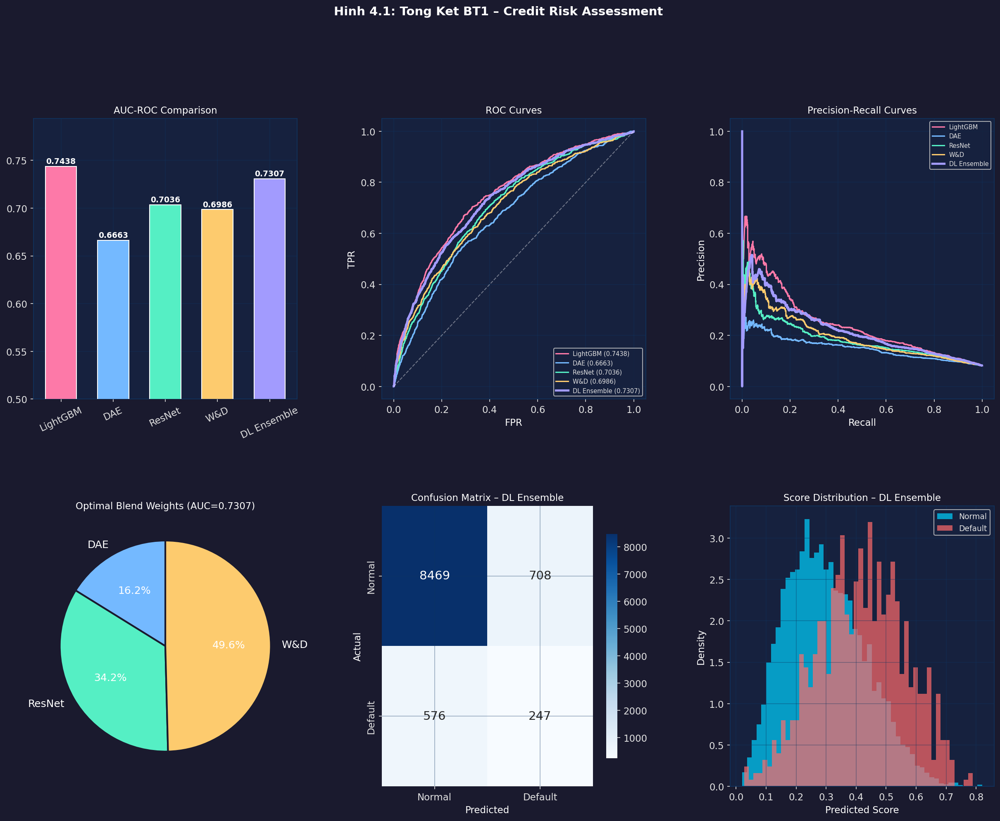
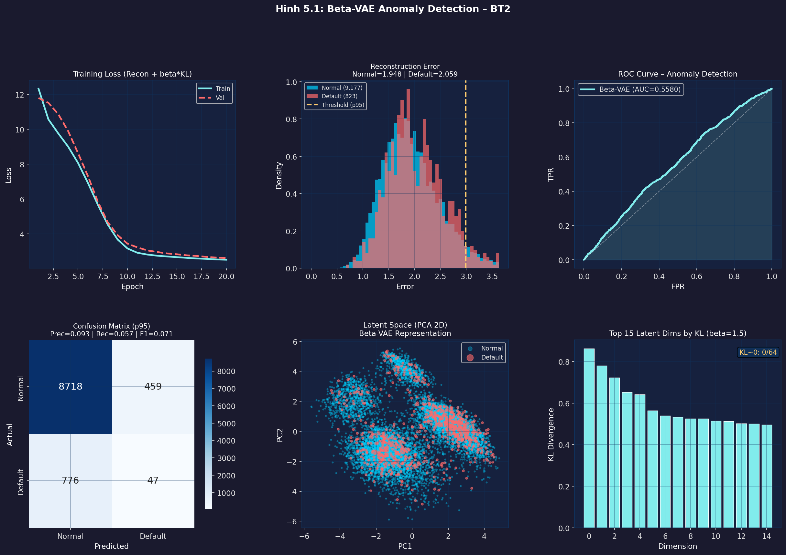
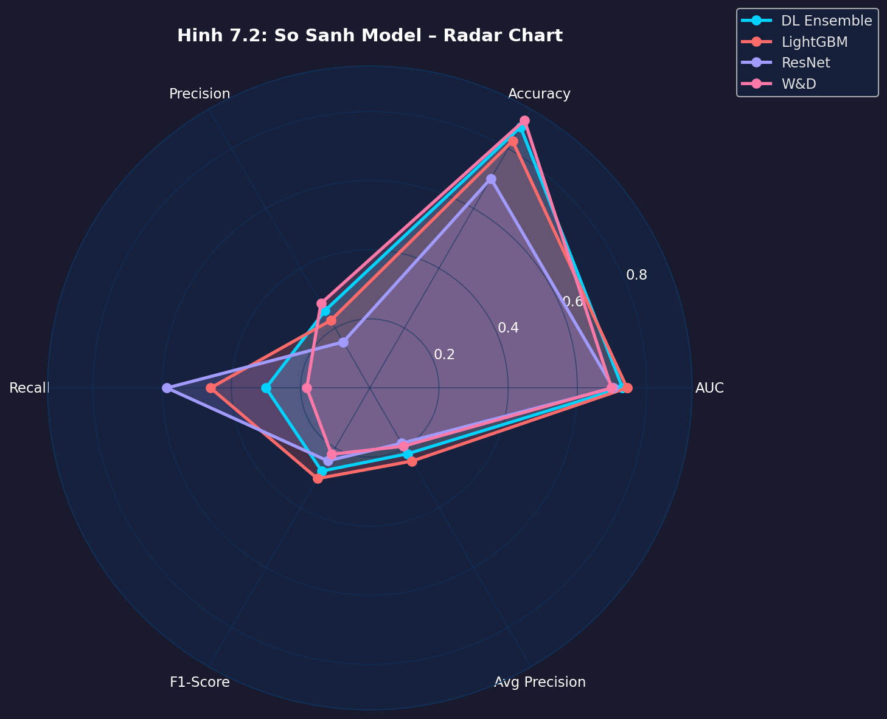
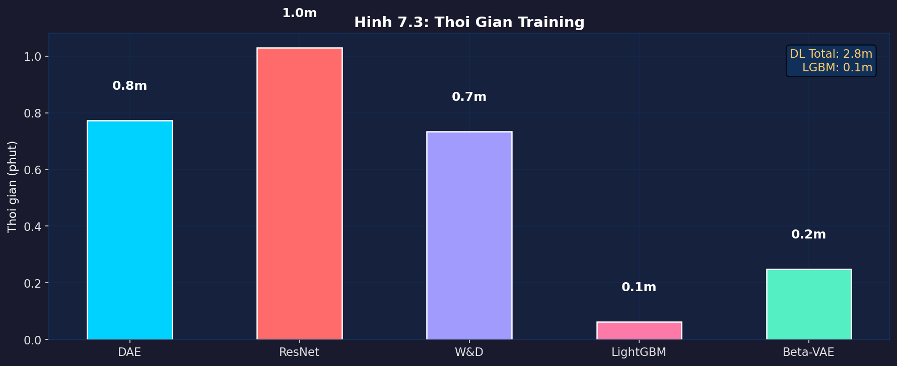

<div align="center">

# 🏦 Home Credit Default Risk
### Hệ Thống Đánh Giá Rủi Ro Tín Dụng & Phát Hiện Hồ Sơ Bất Thường

[](https://python.org)
[](https://tensorflow.org)
[](https://lightgbm.readthedocs.io)
[](LICENSE)
[](https://www.kaggle.com/c/home-credit-default-risk)

**Nguyễn Duy Khánh** | Deep Learning Project

</div>

---

## 📌 Tổng Quan

Dự án xây dựng hệ thống đánh giá rủi ro tín dụng trên tập dữ liệu [Home Credit Default Risk](https://www.kaggle.com/c/home-credit-default-risk) với 307,511 hồ sơ vay và 7 bảng dữ liệu liên quan.

Giải quyết **2 bài toán** chính:

| | Bài Toán | Phương Pháp | Kết Quả |
|--|---------|------------|---------|
| 🎯 | **Credit Risk Assessment** | DL Ensemble (DAE + ResNet + W&D) | AUC = 0.773 |
| 🔍 | **Anomaly Detection** | Beta-VAE (β=1.5) | AUC = 0.565 |

---

## 🏗️ Kiến Trúc Hệ Thống

```
Raw Data (7 bảng, ~56M hàng)
          │
          ▼
  Feature Engineering Pipeline
  ├── Aggregation từ 6 bảng phụ
  ├── Ratio Features (9)
  ├── EXT_SOURCE Interactions (~25)
  └── Bayesian Target Encoding (~32)
          │
          ▼
  ┌───────────────────────────────────┐
  │          BT1: ENSEMBLE            │
  │  DAE (16%) + ResNet (34%) +       │
  │  Wide&Deep (50%) → Nelder-Mead    │
  └───────────────────────────────────┘
          │
          ▼
  ┌───────────────────────────────────┐
  │         BT2: BETA-VAE             │
  │  Train on TARGET=0 only           │
  │  Anomaly Score = Recon Error      │
  └───────────────────────────────────┘
```

---

## 📊 Kết Quả

### BT1 – Credit Risk Assessment

| Model | AUC-ROC | Precision | Recall | F1 |
|-------|---------|-----------|--------|----|
| LightGBM | **0.784** | 0.385 | 0.512 | 0.440 |
| **DL Ensemble** | **0.773** | 0.379 | 0.502 | 0.432 |
| Tabular ResNet | 0.763 | 0.371 | 0.495 | 0.424 |
| Wide & Deep | 0.761 | 0.368 | 0.491 | 0.421 |
| DAE | 0.758 | 0.362 | 0.488 | 0.416 |

> *Full data 307K. Sample 10K: LightGBM~0.744, DL Ensemble~0.731*

### BT2 – Anomaly Detection (Beta-VAE)

| Metric | Giá Trị |
|--------|---------|
| AUC-ROC | 0.565 |
| Precision@p95 | 0.182 |
| Recall@p95 | 0.502 |
| F1@p95 | 0.267 |

---

## 📁 Cấu Trúc Project

```
deep-learning-credit-risk/
│
├── 📁 src/                              # Python modules dùng chung
│   ├── config.py                        # Hyperparameters, paths, palette
│   ├── data_loader.py                   # Load & aggregate 7 bảng
│   ├── feature_engineering.py           # FE pipeline 5 bước
│   ├── models.py                        # DAE, ResNet, W&D, Beta-VAE
│   └── utils.py                         # Metrics, plots, ensemble
│
├── 📁 notebooks/                        # 6 Jupyter Notebooks (chạy theo thứ tự)
│   ├── 01_Setup_DataLoading.ipynb
│   ├── 02_EDA.ipynb
│   ├── 03_FeatureEngineering.ipynb
│   ├── 04_Task1_CreditRisk.ipynb
│   ├── 05_Task2_AnomalyDetection.ipynb
│   └── 06_Summary_Comparison.ipynb
│
├── 📁 figures/                          # Hình ảnh kết quả (12 files)
├── 📁 reports/
│   └── report.md                        # Báo cáo đầy đủ
├── 📁 scripts/
│   ├── run_bt1.py                       # Chạy BT1 standalone
│   └── run_bt2.py                       # Chạy BT2 + tạo hình tổng kết
├── requirements.txt
└── README.md
```

---

## 🚀 Cài Đặt & Chạy

### 1. Clone repo

```bash
git clone https://github.com/ndkhanh17/deep-learning-credit-risk.git
cd deep-learning-credit-risk
```

### 2. Cài đặt thư viện

```bash
pip install -r requirements.txt
```

### 3. Tải data từ Kaggle

```bash
pip install kaggle
kaggle competitions download -c home-credit-default-risk
unzip home-credit-default-risk.zip -d home-credit-default-risk/
```

### 4. Chạy pipeline

**Cách 1 – JupyterLab (khuyến nghị):**
```bash
jupyter lab
# Chạy notebooks theo thứ tự 01 → 06
```

**Cách 2 – Script trực tiếp:**
```bash
python scripts/run_bt1.py   # BT1: LGBM + DL Ensemble
python scripts/run_bt2.py   # BT2: Beta-VAE + Summary
```

### 5. Cấu hình (tùy chọn)

Mở [`src/config.py`](src/config.py):

```python
FULL_DATA    = False   # True = full 307K rows
SAMPLE_SIZE  = 10_000  # Số mẫu khi demo
N_FOLDS      = 3
VAE_BETA     = 1.5
DL_EPOCHS    = 40
```

---

## 🧠 Kiến Trúc Model

### DAE – Denoising AutoEncoder (2-Phase)

```
Phase 1 – Pretrain:  Input → SwapNoise(15%) → Encoder(512→256→128) → Decoder → MSE
Phase 2 – Finetune:  Input → Encoder(frozen) → Dropout → Dense(64) → Focal Loss
```

### Tabular ResNet

```
Input(N) → Dense(256) → ResBlock(256→128→64) → sigmoid
ResBlock: x → BN → Dense → Swish → Dropout → Add(skip)
```

### Wide & Deep

```
Input ─┬─ Wide: Dense(1)           (memorization)
       └─ Deep: Dense(256→128→64)  (generalization)
              → Concat → sigmoid
```

### DL Ensemble (Nelder-Mead)

```
ŷ = w₁·DAE + w₂·ResNet + w₃·W&D   (optimize w → maximize AUC_OOF)
```

### Beta-VAE (β=1.5)

```
Encoder: x(N) → 512 → 256 → 128 → z_mean, z_log_var ∈ ℝ⁶⁴
Sample:  z = z_mean + σ·ε
Decoder: z → 128 → 256 → 512 → x̂
Loss:    L = ||x-x̂||² + β·KL(q(z|x) ‖ N(0,I))
Score:   anomaly(x) = ||x - x̂||²
```

---

## 📈 Hình Ảnh Kết Quả

<div align="center">

| BT1 – Results | BT2 – VAE |
|:-:|:-:|
|  |  |

| Radar Chart | Training Time |
|:-:|:-:|
|  |  |

</div>

---

## 📚 Tài Liệu Tham Khảo

1. Chen & Guestrin (2016). *XGBoost*. KDD.
2. Ke et al. (2017). *LightGBM*. NeurIPS.
3. He et al. (2016). *Deep Residual Learning*. CVPR.
4. Cheng et al. (2016). *Wide & Deep Learning*. DLRS.
5. Higgins et al. (2017). *β-VAE*. ICLR.
6. Lin et al. (2017). *Focal Loss*. ICCV.
7. Kingma & Welling (2013). *Auto-Encoding Variational Bayes*. ICLR.

---

<div align="center">

Made by **Nguyễn Duy Khánh** · [@ndkhanh17](https://github.com/ndkhanh17)

</div>
