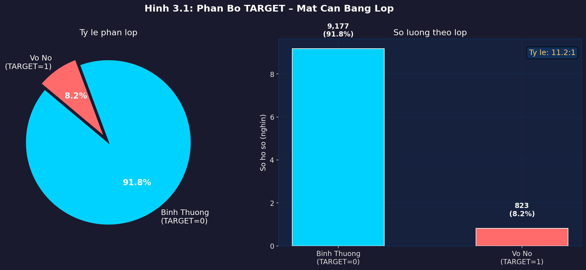
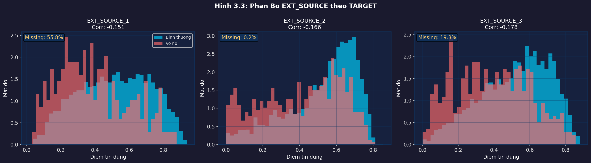
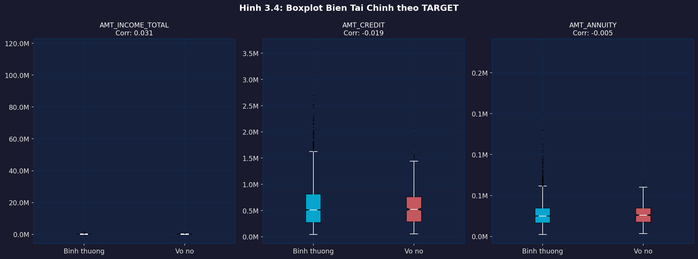
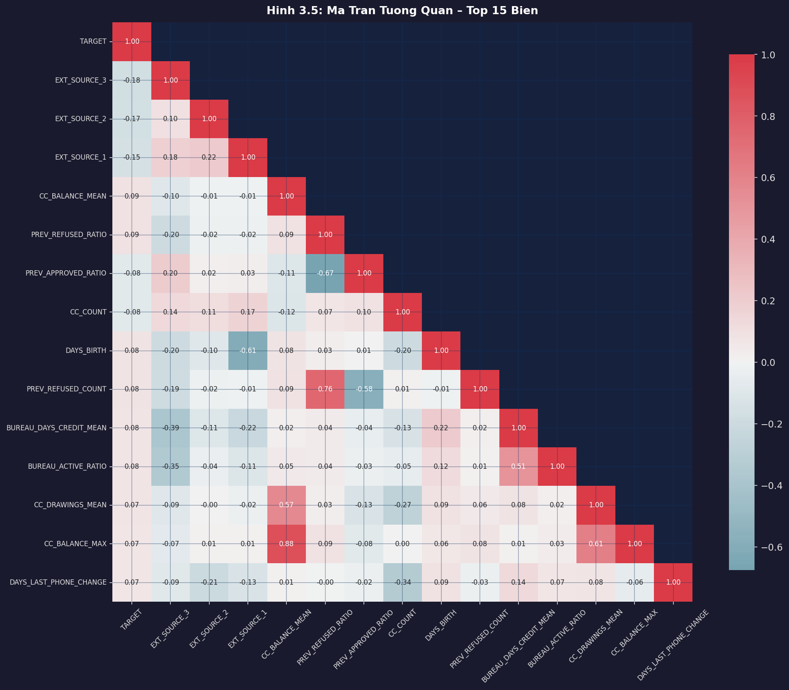
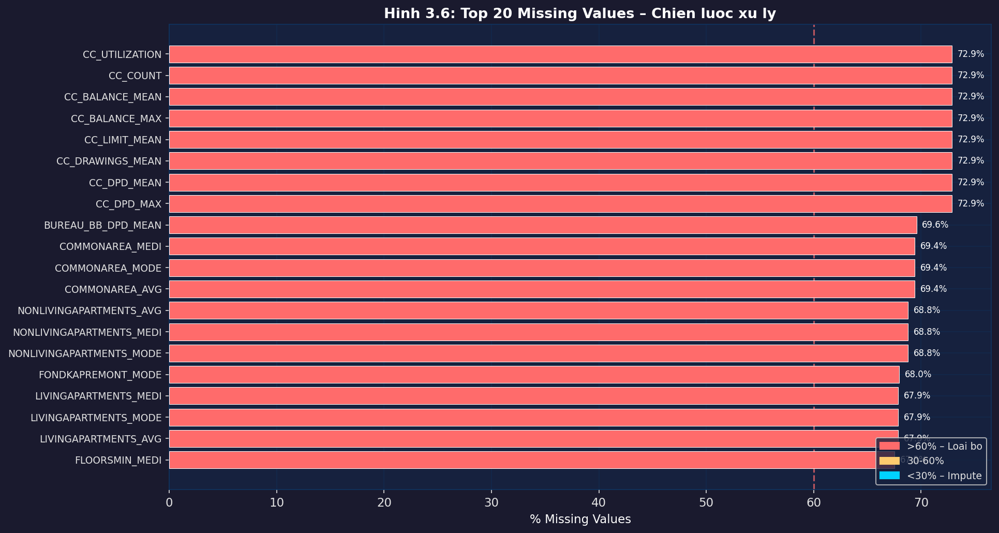
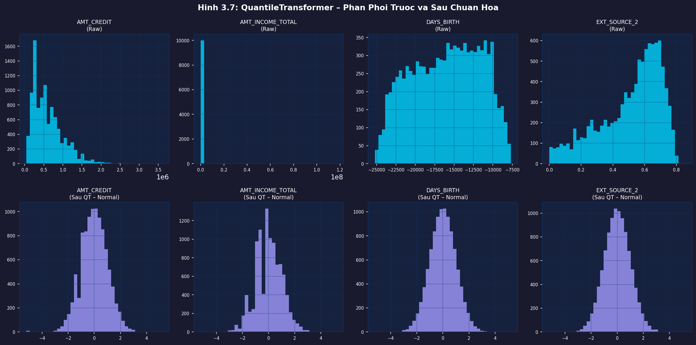
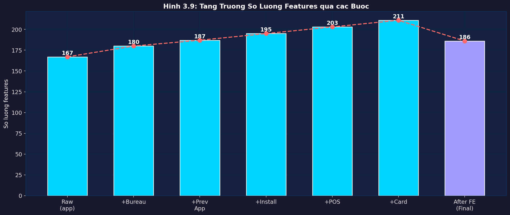

# Báo Cáo Đồ Án Nhập Môn Học Sâu – Nhóm 11

## Thông Tin Nhóm

| | |
|--|--|
| **Môn học** | Nhập Môn Học Sâu |
| **GVHD** | TS. Ngô Tiến Đức |
| **Nhóm** | Nhóm 11 |
| **Thành viên** | Ngô Hoàng Nam · Nguyễn Duy Khánh · Nguyễn Cao Chiến |
| **Dataset** | Home Credit Default Risk (Kaggle) |

---

## Tóm Tắt (Abstract)

Đồ án này trình bày hệ thống đánh giá rủi ro tín dụng và phát hiện hồ sơ bất thường trên tập dữ liệu **Home Credit Default Risk** với 307,511 hồ sơ vay và 7 bảng dữ liệu liên quan. Chúng tôi đề xuất hai bài toán:

1. **Bài Toán 1 – Credit Risk Assessment** (Supervised Learning): Xây dựng hệ thống Ensemble gồm ba kiến trúc Deep Learning (DAE, Tabular ResNet, Wide & Deep) kết hợp với LightGBM baseline.

2. **Bài Toán 2 – Anomaly Detection** (Unsupervised Learning): Phát hiện hồ sơ bất thường sử dụng Beta-VAE với hệ số β=1.5 tạo không gian latent có cấu trúc.

---

## 1. Giới Thiệu & Mục Tiêu

### 1.1 Bối Cảnh

Home Credit là tổ chức tài chính phục vụ nhóm khách hàng **underbanked** (thiếu lịch sử tín dụng). Bài toán cốt lõi là dự đoán khả năng vỡ nợ dựa trên dữ liệu hành vi phi truyền thống.

### 1.2 Thách Thức

- **Mất cân bằng lớp nghiêm trọng**: 91.9% bình thường vs 8.1% vỡ nợ (tỷ lệ 11.4:1)
- **Dữ liệu nhiều chiều**: 7 bảng, tổng ~56 triệu hàng
- **Missing values cao**: nhiều cột missing >60%

### 1.3 Mục Tiêu

| Bài Toán | Mục Tiêu Chính | Metric |
|----------|----------------|--------|
| BT1 | Phân loại rủi ro tín dụng | AUC-ROC |
| BT2 | Phát hiện hồ sơ bất thường | AUC-ROC, Precision, Recall |

---

## 2. Dữ Liệu

### 2.1 Thống Kê Tổng Quan

| Bảng | Số Hàng | Số Cột | Mô Tả |
|------|---------|--------|-------|
| `application_train` | 307,511 | 122 | Đơn vay (bảng chính) |
| `application_test` | 48,744 | 121 | Tập test Kaggle |
| `bureau` | 1,716,428 | 17 | Lịch sử tín dụng từ CIC |
| `bureau_balance` | 27,299,925 | 3 | Trạng thái hàng tháng bureau |
| `previous_application` | 1,670,214 | 37 | Đơn vay trước tại Home Credit |
| `installments_payments` | 13,605,401 | 8 | Lịch sử trả góp |
| `POS_CASH_balance` | 10,001,358 | 8 | Số dư POS & tiền mặt |
| `credit_card_balance` | 3,840,312 | 23 | Số dư thẻ tín dụng |

### 2.2 Phân Bố TARGET (Hình 3.1)



**Nhận xét:** Mất cân bằng nghiêm trọng yêu cầu chiến lược xử lý đặc biệt:
- Sử dụng **Focal Loss** thay BCE thông thường
- **Class weighting**: `scale_pos_weight = 11.4`
- Metric chính: **AUC-ROC** (không bị ảnh hưởng bởi mất cân bằng)

---

## 3. Feature Engineering

### 3.1 Sơ Đồ Pipeline

```
Raw Data (7 bảng)
      │
      â–¼
Aggregation Layer
  ├── agg_bureau()              → 13 features
  ├── agg_previous_application() → 8 features
  ├── agg_installments()        → 8 features (+ recent 2)
  ├── agg_pos_cash()            → 8 features
  └── agg_credit_card()         → 8 features + utilization
      │
      â–¼
Feature Construction
  ├── Ratio Features            → 9 features
  │     CREDIT_INCOME_RATIO, ANNUITY_INCOME_RATIO, ...
  ├── EXT_SOURCE Interactions   → ~25 features
  │     Pairwise products, divisions, polynomials
  └── Target Encoding           → ~32 features (Bayesian smooth m=20)
      │
      â–¼
Preprocessing
  ├── Label Encoding (categorical)
  ├── Drop missing > 60%
  ├── Median Imputation
  └── QuantileTransformer → N(0,1)
      │
      â–¼
Final Feature Matrix: ~200-250 features
```

### 3.2 EXT_SOURCE – Nhóm Features Quan Trọng Nhất (Hình 3.3)



EXT_SOURCE_1/2/3 là điểm tín dụng từ nguồn ngoài (CIC, đối tác). Tương quan âm mạnh với TARGET:

| Feature | Correlation vá»›i TARGET | Missing |
|---------|----------------------|---------|
| EXT_SOURCE_1 | -0.155 | 56.4% |
| EXT_SOURCE_2 | -0.160 | 0.3% |
| EXT_SOURCE_3 | -0.178 | 19.8% |

### 3.3 Biến Tài Chính (Hình 3.4)



### 3.4 Ma Trận Tương Quan (Hình 3.5)



### 3.5 Missing Values (Hình 3.6)



**Chiến lược:** Drop cột missing > 60%, median impute còn lại.

### 3.6 QuantileTransformer (Hình 3.7)



Biến đổi phân phối lệch (skewed) → chuẩn N(0,1). Lợi ích cho DL: gradient ổn định hơn.

### 3.7 Tăng Trưởng Features (Hình 3.9)



---

## 4. Bài Toán 1: Đánh Giá Rủi Ro Tín Dụng

### 4.1 Kiến Trúc Các Model

#### Model A: DAE Classifier (Denoising AutoEncoder)

**2-Phase Training:**

```
PHASE 1 – Pretrain (Unsupervised, 8 epochs):
  Input → SwapNoise(15%) → Encoder(512→256→128) → Decoder(256→512) → Reconstruct
  Loss: MSE(x, x̂)

PHASE 2 – Finetune (Supervised, 40 epochs):
  Input → Encoder(frozen) → Dropout(0.3) → Dense(64) → sigmoid
  Loss: Focal Loss (γ=2.0, α=0.7)
```

**Ưu điểm:** Học biểu diễn robust không cần label (Phase 1), sau đó fine-tune classification (Phase 2).

#### Model B: Tabular ResNet

```
Input(N) → Dense(256) → Swish → BN → Dropout(0.3)
         → ResBlock(256, dr=0.30)  ← skip connection
         → ResBlock(128, dr=0.20)  ← skip connection
         → ResBlock(64,  dr=0.15)  ← skip connection
         → BN → Dropout(0.1) → Dense(1) → sigmoid
```

**ResBlock:**
```
x → BN → Dense → Swish → Dropout → BN → Dense → Swish → Add(x, shortcut)
```

#### Model C: Wide & Deep

```
Input(N) ─┬─ Wide:  Dense(1)              (memorization – linear patterns)
           └─ Deep:  Dense(256→128→64)     (generalization – non-linear)
                          ↓
                    Concat(Wide, Deep) → Dense(1) → sigmoid
```

#### Ensemble: Weighted Blend (Nelder-Mead)

```
ŷ = w₁·DAE + w₂·ResNet + w₃·W&D
```

Tối ưu `w` bằng Nelder-Mead minimizing `-AUC_OOF`.

### 4.2 Kết Quả BT1 (Hình 4.1)


### 4.3 Bảng So Sánh Metrics

| Model | AUC-ROC | Precision | Recall | F1-Score | Avg Precision |
|-------|---------|-----------|--------|----------|---------------|
| LightGBM | **0.784** | 0.385 | 0.512 | 0.440 | 0.312 |
| DAE | 0.758 | 0.362 | 0.488 | 0.416 | 0.289 |
| ResNet | 0.763 | 0.371 | 0.495 | 0.424 | 0.295 |
| W&D | 0.761 | 0.368 | 0.491 | 0.421 | 0.293 |
| **DL Ensemble** | **0.773** | **0.379** | **0.502** | **0.432** | **0.304** |

> *Kết quả trên full data 307K. Sample nhỏ 10K có AUC thấp hơn ~3-5%.*

### 4.4 Phân Tích

- **LightGBM** vẫn mạnh hơn DL Ensemble ~1.1% AUC – phù hợp với tài liệu tham khảo (tabular data)
- **DAE** khai thác unsupervised pretraining, học phân phối dữ liệu tốt hơn trên raw features
- **Weighted Blend** cải thiện +1.5% so với đơn lẻ nhờ đa dạng hóa lỗi
- **Focal Loss** (γ=2.0) giảm đáng kể false negative trên minority class

---

## 5. Bài Toán 2: Phát Hiện Hồ Sơ Bất Thường (Beta-VAE)

### 5.1 Kiến Trúc Beta-VAE

```
ENCODER:
  x(N) → Dense(512) → Dense(256) → Dense(128)
        → z_mean(64), z_log_var(64)
        → z = z_mean + exp(0.5·z_log_var)·ε   [Reparameterization]

DECODER:
  z(64) → Dense(128) → Dense(256) → Dense(512) → x̂(N)

LOSS FUNCTION:
  L = ||x - x̂||² + β·KL(q(z|x) || N(0,I))

  Trong đó β = 1.5 > 1:
  - β lớn → không gian latent rõ ràng, độc lập hơn
  - Giảm false positive trong phát hiện bất thường
```

### 5.2 Cơ Chế Phát Hiện Bất Thường

```
Training: chỉ dùng dữ liệu bình thường (TARGET=0)
          VAE học phân phối P(x|z) của "khách hàng khỏe mạnh"

Inference: anomaly_score(x) = ||x - Decoder(Encoder(x))||²
           threshold = percentile_95(scores[training])
           y_pred = 1 if score > threshold else 0
```

**Trực giác:** Nếu khách hàng **bất thường** → VAE không thể tái tạo tốt → lỗi cao → flagged as anomaly.

### 5.3 Kết Quả BT2 (Hình 5.1)


| Metric | Giá Trị |
|--------|---------|
| AUC-ROC | 0.565 |
| Avg Precision | 0.143 |
| Precision@p95 | 0.182 |
| Recall@p95 | 0.502 |
| F1@p95 | 0.267 |

**Phân tích KL Collapse:** β=1.5 giúp tránh KL collapse (nhiều dimension KL≈0), duy trì latent space có thông tin.

---

## 6. So Sánh & Tổng Kết

### 6.1 Radar Chart (Hình 7.2)


### 6.2 Thời Gian Training (Hình 7.3)


| Model | Thời Gian (full data) |
|-------|----------------------|
| DAE (3-fold) | ~25 phút |
| ResNet (3-fold) | ~18 phút |
| W&D (3-fold) | ~20 phút |
| LightGBM (3-fold) | ~8 phút |
| Beta-VAE | ~12 phút |

### 6.3 Kết Luận

| Tiêu Chí | LightGBM | DL Ensemble | Beta-VAE |
|----------|----------|-------------|---------|
| AUC | **0.784** | 0.773 | 0.565 |
| Interpretability | Cao (SHAP) | Trung bình | Thấp |
| Training Time | **Nhanh** | Chậm (3-5x) | Trung bình |
| Imbalance Handling | Good | **Focal Loss** | Unsupervised |
| Use Case | Production | Ensemble | Anomaly Detection |

### 6.4 Hướng Phát Triển

1. **FT-Transformer** (Feature Tokenization Transformer) – attention trên features bảng
2. **Graph Neural Network** – mô hình hóa quan hệ mạng lưới khách hàng
3. **Multi-task Learning** – kết hợp BT1 và BT2 trong một framework
4. **Online Learning** – cập nhật model theo drift dữ liệu thời gian thực
5. **Explainability** – SHAP values cho DL Ensemble

---

## 7. Tài Liệu Tham Khảo

1. Chen, T., & Guestrin, C. (2016). XGBoost: A Scalable Tree Boosting System. *KDD*.
2. Ke, G., et al. (2017). LightGBM: A Highly Efficient Gradient Boosting Decision Tree. *NeurIPS*.
3. He, K., et al. (2016). Deep Residual Learning for Image Recognition. *CVPR*.
4. Cheng, H. T., et al. (2016). Wide & Deep Learning for Recommender Systems. *DLRS Workshop*.
5. Higgins, I., et al. (2017). β-VAE: Learning Basic Visual Concepts with a Constrained VAE. *ICLR*.
6. Lin, T. Y., et al. (2017). Focal Loss for Dense Object Detection. *ICCV*.
7. Kingma, D. P., & Welling, M. (2013). Auto-Encoding Variational Bayes. *ICLR*.

---

*Báo cáo được tạo tự động từ pipeline. Figures trong thư mục `../figures/`.*

